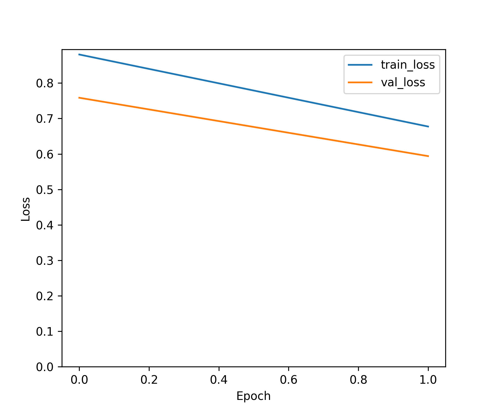

Performance of Affine Coupling Invertible Neural Network
========================================================

# Objective

Test the effectiveness of affine coupling layer with zero bias in the final layer, trained with 0.01 STD noise added  

# Training Curves
  
  
  

# MSE Errors (Normalized)
  
<!DOCTYPE html>
<head>
<meta charset="UTF-8">

</head>
<html>
<body>
    <pre style="font-family:Menlo,'DejaVu Sans Mono',consolas,'Courier New',monospace"><code>               Losses                
┏━━━━┳━━━━━━━━━━━━┳━━━━━━━━━━━━━━━━━┓
┃ 👀 ┃ Train Loss ┃ Validation Loss ┃
┡━━━━╇━━━━━━━━━━━━╇━━━━━━━━━━━━━━━━━┩
│    │   0.6774   │     0.5939      │
└────┴────────────┴─────────────────┘
</code></pre>
</body>
</html>

# MAE Errors (Unscaled)
  
<!DOCTYPE html>
<head>
<meta charset="UTF-8">

</head>
<html>
<body>
    <pre style="font-family:Menlo,'DejaVu Sans Mono',consolas,'Courier New',monospace"><code>                                   Error Statistics                                   
┏━━━━━━━━━━━━━━━━━━━━━━━━┳━━━━━━━━━━━━┳━━━━━━━━━━━┳━━━━━━━━━━━━━━━━━┳━━━━━━━━━━━━━━━━┓
┃ Label                  ┃ Train Mean ┃ Train Std ┃ Validation Mean ┃ Validation Std ┃
┡━━━━━━━━━━━━━━━━━━━━━━━━╇━━━━━━━━━━━━╇━━━━━━━━━━━╇━━━━━━━━━━━━━━━━━╇━━━━━━━━━━━━━━━━┩
│ Fetal Saturation Error │     0.0744 │    0.0564 │          0.0743 │         0.0564 │
└────────────────────────┴────────────┴───────────┴─────────────────┴────────────────┘
</code></pre>
</body>
</html>

# Error Distribution
  
  
  

# Trainer Details

        Model Properties:
        INN2(
  (model): Sequential(
    (0): AffineCouplingLayer(
      (s): Sequential(
        (0): Linear(in_features=20, out_features=20, bias=True)
        (1): ReLU()
        (2): Linear(in_features=20, out_features=20, bias=True)
        (3): ReLU()
      )
      (t): Sequential(
        (0): Linear(in_features=20, out_features=20, bias=True)
        (1): ReLU()
        (2): Linear(in_features=20, out_features=20, bias=True)
        (3): ReLU()
      )
    )
    (1): BatchNorm1d(40, eps=1e-05, momentum=0.1, affine=True, track_running_stats=True)
    (2): AffineCouplingLayer(
      (s): Sequential(
        (0): Linear(in_features=20, out_features=20, bias=True)
        (1): ReLU()
        (2): Linear(in_features=20, out_features=20, bias=True)
        (3): ReLU()
      )
      (t): Sequential(
        (0): Linear(in_features=20, out_features=20, bias=True)
        (1): ReLU()
        (2): Linear(in_features=20, out_features=20, bias=True)
        (3): ReLU()
      )
    )
    (3): BatchNorm1d(40, eps=1e-05, momentum=0.1, affine=True, track_running_stats=True)
    (4): AffineCouplingLayer(
      (s): Sequential(
        (0): Linear(in_features=20, out_features=20, bias=True)
        (1): ReLU()
        (2): Linear(in_features=20, out_features=20, bias=True)
        (3): ReLU()
      )
      (t): Sequential(
        (0): Linear(in_features=20, out_features=20, bias=True)
        (1): ReLU()
        (2): Linear(in_features=20, out_features=20, bias=True)
        (3): ReLU()
      )
    )
    (5): BatchNorm1d(40, eps=1e-05, momentum=0.1, affine=True, track_running_stats=True)
    (6): AffineCouplingLayer(
      (s): Sequential(
        (0): Linear(in_features=20, out_features=20, bias=True)
        (1): ReLU()
        (2): Linear(in_features=20, out_features=20, bias=True)
        (3): ReLU()
      )
      (t): Sequential(
        (0): Linear(in_features=20, out_features=20, bias=True)
        (1): ReLU()
        (2): Linear(in_features=20, out_features=20, bias=True)
        (3): ReLU()
      )
    )
    (7): BatchNorm1d(40, eps=1e-05, momentum=0.1, affine=True, track_running_stats=True)
    (8): Linear(in_features=40, out_features=1, bias=False)
  )
)
        Data Loader Properties:
        365904 rows, 40 x columns, 1 y columns
        Batch Size: 2048
        X Columns: ['10_1.0_2_/_10_1.0_1', '15_1.0_2_/_15_1.0_1', '19_1.0_2_/_19_1.0_1', '24_1.0_2_/_24_1.0_1', '28_1.0_2_/_28_1.0_1', '33_1.0_2_/_33_1.0_1', '37_1.0_2_/_37_1.0_1', '41_1.0_2_/_41_1.0_1', '46_1.0_2_/_46_1.0_1', '50_1.0_2_/_50_1.0_1', '55_1.0_2_/_55_1.0_1', '59_1.0_2_/_59_1.0_1', '64_1.0_2_/_64_1.0_1', '68_1.0_2_/_68_1.0_1', '72_1.0_2_/_72_1.0_1', '77_1.0_2_/_77_1.0_1', '81_1.0_2_/_81_1.0_1', '86_1.0_2_/_86_1.0_1', '90_1.0_2_/_90_1.0_1', '94_1.0_2_/_94_1.0_1', '10_2.0_2_/_10_2.0_1', '15_2.0_2_/_15_2.0_1', '19_2.0_2_/_19_2.0_1', '24_2.0_2_/_24_2.0_1', '28_2.0_2_/_28_2.0_1', '33_2.0_2_/_33_2.0_1', '37_2.0_2_/_37_2.0_1', '41_2.0_2_/_41_2.0_1', '46_2.0_2_/_46_2.0_1', '50_2.0_2_/_50_2.0_1', '55_2.0_2_/_55_2.0_1', '59_2.0_2_/_59_2.0_1', '64_2.0_2_/_64_2.0_1', '68_2.0_2_/_68_2.0_1', '72_2.0_2_/_72_2.0_1', '77_2.0_2_/_77_2.0_1', '81_2.0_2_/_81_2.0_1', '86_2.0_2_/_86_2.0_1', '90_2.0_2_/_90_2.0_1', '94_2.0_2_/_94_2.0_1']
        Y Columns: ['Fetal Saturation']
        
        Validation Method:
        Split the data randomly using np.random.shuffle with a split of 0.8
        Loss Function:
        Torch Loss Function: MSELoss()
        Optimizer Properties":
        SGD (
Parameter Group 0
    dampening: 0
    differentiable: False
    foreach: None
    lr: 0.0009
    maximize: False
    momentum: 0.89
    nesterov: True
    weight_decay: 0
)
          
