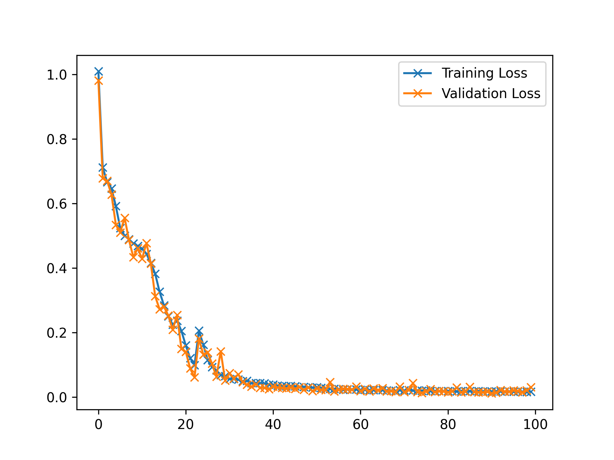
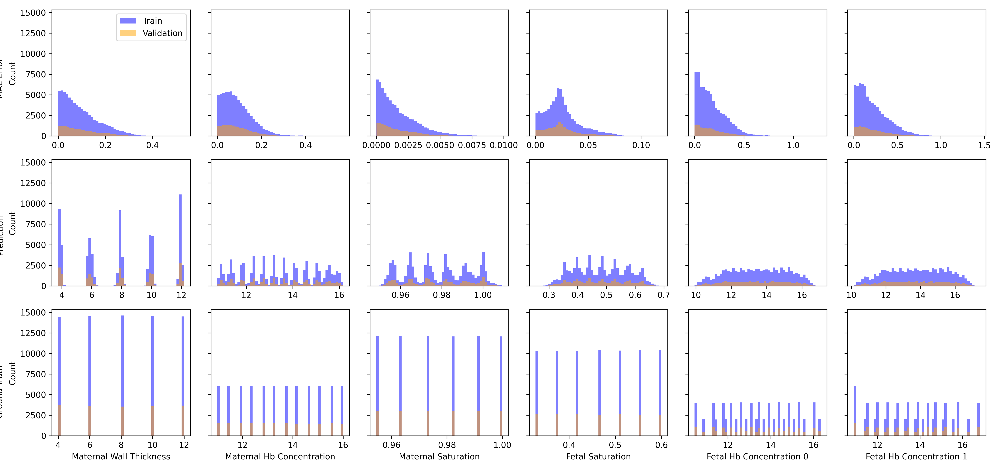

Inverse Modelling Report
========================

# Objective


Predicting with 90% Random Split(As opposed to a hold One out style). Same as report6. Except, trying out a different normalization scheme. Where it scales all detector intensity logs using a single scale. More specifically, maps the values from -1 to -20 between -1 and +1. The intuition behind this was that this sort of normalization should preserve inter-detector scaling.  

# Comments


Somehow performs slightly worse than per detector scaling. Which does not make sense to me  

# Data Length


90720  

# Model Used


```
=================================================================
Layer (type:depth-idx)                   Param #
=================================================================
SplitChannelCNN                          --
├─CNN2FC: 1-1                            --
│    └─CNN1d: 2-1                        --
│    │    └─Sequential: 3-1              228
│    └─PerceptronBD: 2-2                 --
│    │    └─Sequential: 3-2              1,128
=================================================================
Total params: 1,356
Trainable params: 1,356
Non-trainable params: 0
=================================================================
```  

# Model Trainer Params


```

        Model Properties:
        SplitChannelCNN(
  (network): CNN2FC(
    (cnn): CNN1d(
      (model): Sequential(
        (0): Conv1d(4, 4, kernel_size=(10,), stride=(1,), groups=4)
        (1): BatchNorm1d(4, eps=1e-05, momentum=0.1, affine=True, track_running_stats=True)
        (2): Dropout1d(p=0.5, inplace=False)
        (3): ReLU()
        (4): Conv1d(4, 8, kernel_size=(5,), stride=(1,), groups=4)
        (5): BatchNorm1d(8, eps=1e-05, momentum=0.1, affine=True, track_running_stats=True)
        (6): Dropout1d(p=0.5, inplace=False)
        (7): ReLU()
        (8): Conv1d(8, 16, kernel_size=(3,), stride=(1,), groups=4)
        (9): Flatten(start_dim=1, end_dim=-1)
      )
    )
    (fc): PerceptronBD(
      (model): Sequential(
        (0): Linear(in_features=80, out_features=12, bias=True)
        (1): BatchNorm1d(12, eps=1e-05, momentum=0.1, affine=True, track_running_stats=True)
        (2): Dropout1d(p=0.5, inplace=False)
        (3): ReLU()
        (4): Linear(in_features=12, out_features=6, bias=True)
        (5): BatchNorm1d(6, eps=1e-05, momentum=0.1, affine=True, track_running_stats=True)
        (6): Dropout1d(p=0.5, inplace=False)
        (7): ReLU()
        (8): Linear(in_features=6, out_features=6, bias=True)
        (9): Flatten(start_dim=1, end_dim=-1)
      )
    )
  )
)
        Optimizer Properties"
        SGD (
Parameter Group 0
    dampening: 0
    differentiable: False
    foreach: None
    lr: 0.0005
    maximize: False
    momentum: 0.91
    nesterov: False
    weight_decay: 0.0001
)
        DataLoader Params: 
            Batch Size: 4096
            Validation Method: Split the data randomly using np.random.shuffle with a split of 0.8
        Loss:
            Train Loss: 0.016865895001005833
            Val. Loss: 0.03036371740057565
```  

# Loss Curves
  
  
  

# Prediction & Error Distribution
  
  
  
